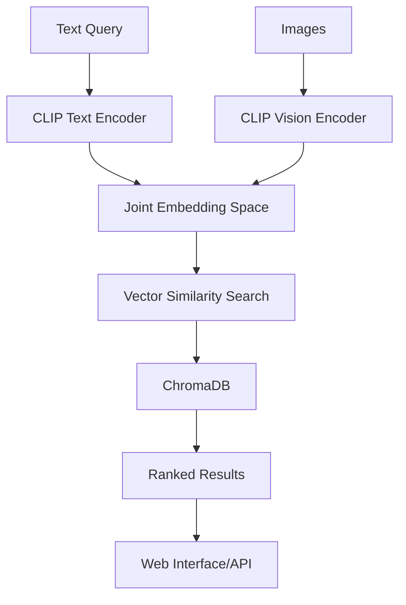

# Multi-Modal Search Engine Using CLIP

A powerful image search engine that retrieves images based on natural language text queries by leveraging the joint embedding space of OpenAI's CLIP model.


## Overview

This project implements a **multimodal search engine** that can find images using natural language descriptions. Unlike traditional image search that relies on metadata or tags, this system understands the **semantic meaning** of both text queries and image content through CLIP's joint embedding space.

### Key Features

- **Natural Language Search**: Query images using descriptive text like "dog playing in park"
- **Semantic Understanding**: Finds images based on meaning, not just keywords
- **Fast Vector Search**: Powered by ChromaDB for efficient similarity search
- **Web Interface**: Clean, responsive frontend for easy interaction
- **REST API**: Full API support for integration with other applications
- **COCO Dataset**: Pre-trained on COCO 2017 validation dataset

## Screenshots

<div align="center">
  
  
</div>

<div align="center">
  
  
</div>

## Quick Start

### Prerequisites

- Python 3.8 or higher
- CUDA-compatible GPU (recommended for better performance)
- COCO 2017 validation dataset

### Installation

1. **Clone the repository**
   ```bash
   git clone https://github.com/yourusername/Multi-modal-Search-Engine-Using-CLIP.git
   cd Multi-modal-Search-Engine-Using-CLIP
   ```

2. **Activate virtual environment**
   ```bash
   # Windows
   source venv/Scripts/activate
   
   # Linux/Mac
   source venv/bin/activate
   ```

3. **Install dependencies**
   ```bash
   pip install torch transformers chromadb fastapi uvicorn pillow requests
   ```

4. **Prepare the dataset**
   - Download COCO 2017 validation dataset
   - Place images in `data/val2017/` directory
   - Place annotations as `data/annotations/captions_val2017.json`

5. **Run the application**
   ```bash
   python run_search_engine.py
   ```

### Alternative: Manual Setup

```bash
# 1. Ingest the data
python ingest_data.py

# 2. Start the API server
uvicorn api:app --reload --host 127.0.0.1 --port 8000
```

## Usage

### Web Interface
Open `frontend/index.html` in your browser and start searching!

### API Endpoints

- **Health Check**: `GET http://127.0.0.1:8000/health`
- **Search Images**: `GET http://127.0.0.1:8000/search?query=dog&k=5`

### Example Queries

- "A dog playing fetch in a field"
- "Person riding a bicycle"
- "Red car on the street"
- "Food on a table"
- "Happy people at a party"

## Architecture

### Tech Stack

- **Backend**: Python, FastAPI, Uvicorn
- **AI/ML**: PyTorch, Hugging Face Transformers, OpenAI CLIP
- **Vector Database**: ChromaDB
- **Frontend**: HTML, CSS, JavaScript
- **Data**: COCO 2017 Dataset

### System Flow



### Key Components

1. **Data Ingestion** (`ingest_data.py`): Processes COCO dataset and creates embeddings
2. **API Server** (`api.py`): FastAPI server with search endpoints
3. **Search Engine** (`search_engine.py`): Core search functionality
4. **Web Frontend** (`frontend/index.html`): User interface
5. **Configuration** (`config.py`): Centralized settings

## Configuration

Edit `config.py` to customize:

- **Data split**: `val` (validation) or `train` (training)
- **Model**: CLIP model variant
- **API settings**: Host, port, results count
- **Database**: Collection name, storage path

## Performance

- **Model**: OpenAI CLIP ViT-B/32
- **Embedding Dimension**: 512
- **Search Speed**: ~100ms per query
- **Dataset Size**: 5,000 validation images
- **Memory Usage**: ~2GB GPU / ~4GB CPU

## Contributing

We welcome contributions! Please feel free to submit a Pull Request.

### Development Setup

1. Fork the repository
2. Create a feature branch
3. Make your changes
4. Test thoroughly
5. Submit a pull request

## License

This project is licensed under the MIT License - see the [LICENSE](LICENSE) file for details.

## Collaborators

**Made by:**
- **Gurpreet Kukkar** - [GitHub Profile](https://github.com/gurpreetkukkar)
- **Rajat Savdekar** - [GitHub Profile](https://github.com/rajatsavdekar)

## Acknowledgments

- OpenAI for the CLIP model
- Hugging Face for the Transformers library
- ChromaDB team for the vector database
- COCO dataset contributors
- FastAPI and Uvicorn for the web framework

## References

- [CLIP: Learning Transferable Visual Representations from Natural Language Supervision](https://arxiv.org/abs/2103.00020)
- [ChromaDB Documentation](https://docs.trychroma.com/)
- [FastAPI Documentation](https://fastapi.tiangolo.com/)
- [COCO Dataset](https://cocodataset.org/)

## Troubleshooting

### Common Issues

1. **"Database not found" error**
   - Run `python ingest_data.py` first

2. **CUDA out of memory**
   - Change `DEVICE = "cpu"` in `config.py`

3. **Port conflicts**
   - Modify `API_PORT` in `config.py`

4. **Missing images**
   - Ensure COCO dataset is properly downloaded and placed in correct directories

### Support

If you encounter any issues, please:
1. Check the troubleshooting section above
2. Search existing issues
3. Create a new issue with detailed information

---

<div align="center">
  <p>Star this repository if you found it helpful!</p>
  <p>Made by Gurpreet Kukkar & Rajat Savdekar</p>
</div>
